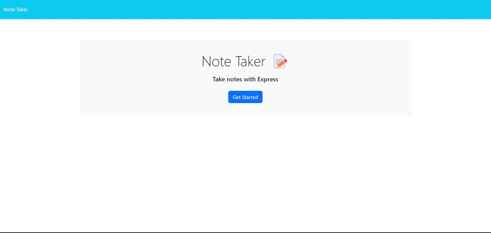
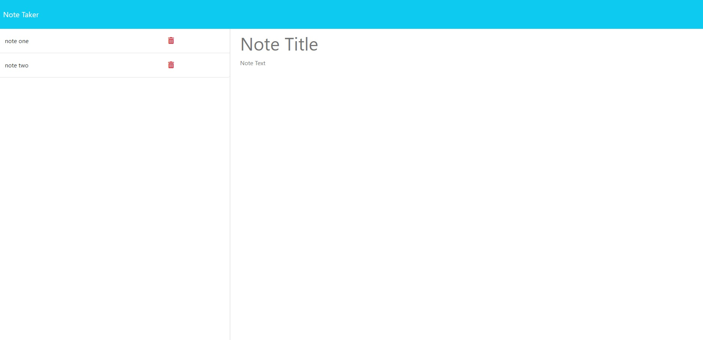

# Note App
## Description
This project was undertaken as part of a coding bootcamp. For this challenge the front end is completed for us but we need to create a server with the backend routes. The view routes should take us to the seperate page to create notes. The api routes should add to the db.json file and the front end code updates the page with the note. A bonus is adding the delete function.

## Installation
If you wish to run this project locally on your own computer, assuming you have git installed, input the following code in your terminal.
git clone https://github.com/philcurtis4/note_app_11
## Usage
The live site may be viewed at the following url.
https://YOUR_USERNAME.github.io/REPO_NAME/
Here is a screenshot of the page.

    
## Credits
The front end of this project was created by the Rutgers bootcamp. Backend was completed by Philip Curtis.
## License
This project has a MIT License. For more information read the LICENSE file.
---